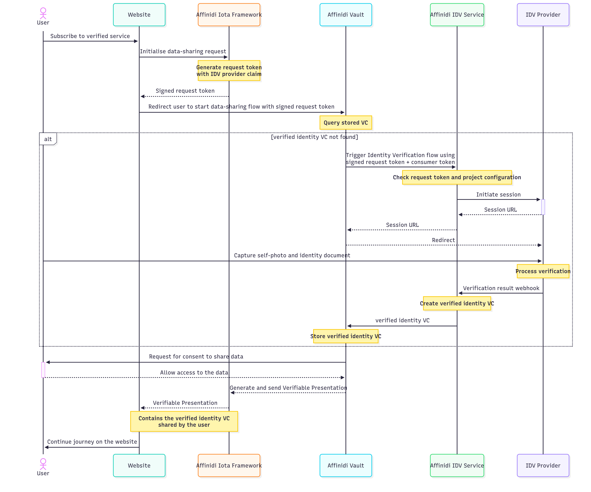

# 🚀 Affinidi IDV Configuration Guide

<div align="center">
  
</div>

> [!IMPORTANT]
> This guide is for learning, experimentation, and prototyping only.
> **Do not use this configuration as-is in production environments.**
> Please review, test, and secure your implementation before deploying to production.


## 📖 Table of Contents
- [Overview](#overview)
- [Architecture](#architecture)
- [Pre-Requisite](#pre-requisite)
- [Setup Instructions](#setup-instructions)
- [Environment Variable Setup](#environment-variable-setup)
- [Presentation Definitions](#presentation-definitions)
- [Code Reference](#code-reference)
- [Further Reading](#further-reading)
- [Disclaimer](#disclaimer)


## 🧭 Overview

**Affinidi IDV (Identity Verification)** enables secure, privacy-preserving verification of user identity documents (such as Driver's License and Passport) using decentralized credentials and user consent.
It leverages the [OID4VP](https://openid.net/specs/openid-4-verifiable-presentations-1_0.html) standard, built on OAuth 2.0, for requesting and receiving verified credentials from Affinidi Vault.


## 🏗️ Architecture

- **IDV Configuration:**
  Set up wallets, enable IDV, configure redirect flow, and define presentation definitions for credential queries.

- **Credential Query Flow:**
  


## 🧑‍💻 Pre-Requisite

> [!IMPORTANT]
> [!IMPORTANT]
> Mandatory steps before proceeding to next steps.

### Create Personal Access Token (PAT)

Personal Access Token (PAT) is like a machine user that acts on your behalf to the Affinidi services. You can use the PAT to authenticate to the Affinidi services and automate specific tasks within your application. A Personal Access Token (PAT) lives outside of Projects, meaning PAT can access multiple projects once granted by the user.

- More details: [Personal Access Token](https://docs.affinidi.com/dev-tools/affinidi-cli/manage-token/#how-does-pat-authentication-works)
- PAT is needed for `Affinidi TDK Auth provider`.

You can refer the [Affinidi Documentation](https://docs.affinidi.com/dev-tools/affinidi-cli/manage-token/#affinidi-token-create-token) for creating pesronal access token from CLI.

**Steps to Create PAT(Personal Access Token):**

1. **Log in to Affinidi CLI:**
   ```sh
   affinidi start
   ```

2. **Create a token:**
   ```sh
   affinidi token create-token
   ```

   Follow the instruction

   ```
    ? Enter the value for name workshopPAT
    ? Generate a new keypair for the token? yes
    ? Enter a passphrase to encrypt the private key. Leave it empty for no encryption ******
    ? Add token to active project and grant permissions? yes
    ? Enter the allowed resources, separated by spaces. Use * to allow access to all project resources *
    ? Enter the allowed actions, separated by spaces. Use * to allow all actions *
   ```

   **Sample response:**
   ```json
    Creating Personal Access Token... Created successfully!
    Adding token to active project... Added successfully!
    Granting permissions to token... Granted successfully!
    {
      "id": "**********",
      "ari": "ari:iam:::token/**********",
      "ownerAri": "ari:iam:::user/**********",
      "name": "workshopPAT",
      "scopes": [
        "openid",
        "offline_access"
      ],
      "authenticationMethod": {
        "type": "PRIVATE_KEY",
        "signingAlgorithm": "RS256",
        "publicKeyInfo": {
          "jwks": {
            "keys": [
              {
                "use": "sig",
                "kty": "RSA",
                "kid": "**********",
                "alg": "RS256",
                "n": "**********",
                "e": "AQAB"
              }
            ]
          }
        }
      }
    }

    Use the projectId, tokenId, privateKey, and passphrase (if provided) to use this token with Affinidi TDK
    {
      "tokenId": "*******",
      "projectId": "*******",
      "privateKey": "*******",
      "passphrase": "******"
    }
    ›   Warning:
    ›   Please save the privateKey and passphrase (if provided) somewhere safe. You will not be able to view them again.
    ›

   ```

   For more details on the command run the below command

   ```sh
   affinidi token create-token --help
   ```


- Create a Wallet in Affinidi Portal (only DID:Key is supported).
- Ensure your redirect URL matches your app endpoint (e.g., `http://localhost:8010/idv`).


## ⚙️ Setup Instructions

1. **Access Affinidi Portal:**
   Go to [Affinidi Portal](https://portal.affinidi.com/login) and navigate to the Affinidi Iota Framework page.

2. **Create Configuration:**
   - Click **Create Configuration** and set:
     - **Wallet:** Create/select a wallet (DID:Key only).
     - **Enable Identity Verification (IDV):** Check the box.
     - **Data Sharing Flow Mode:** Redirect (reference implementation).
     - **Vault JWT Expiration Time:** Set credential offer lifetime.
     - **Redirect URLs:** `http://localhost:8010/idv`
   - Optionally enable:
     - **Verification:** Verify credentials shared by users.
     - **Consent Audit Log:** Store user consent logs.

3. **Add Supported Schemas:**
   Define schemas for each credential type you wish to query.

4. **Create Presentation Definitions:**
   Use Presentation Exchange (PEX) to define queries for each VC type (see [Presentation Definitions](#presentation-definitions) below).


## ⚙️ Environment Variable Setup

Update your `.env` file with the required configuration:

```env
# IDV Config Redirect flow : Callback should be is `http://localhost:8010/idv`
IDV_CONFIG_ID="your-config-id"
IDV_CREDENTIAL_QUERY_DL="your-drivers-license-query-id"
IDV_CREDENTIAL_QUERY_PASSPORT="your-passport-query-id"
IDV_CREDENTIAL_QUERY_ANY="your-any-id-query-id"
```

- Replace each value with the corresponding ID from your IDV configuration.
- Ensure the callback URL matches your app’s endpoint.


## 📚 Presentation Definitions

Define Presentation Exchange queries for each credential type.

**Request Verified DL**
```json
{
  "id": "verified_identity",
  "input_descriptors": [
    {
      "id": "id_document_input",
      "name": "Drivers License",
      "constraints": {
        "fields": [
          {
            "path": [
              "$.issuer",
              "$.vc.issuer",
              "$.iss"
            ],
            "purpose": "Only accept credentials issued by Affinidi IDV",
            "filter": {
              "type": "string",
              "pattern": "^did:web:idv.affinidi.com$"
            }
          },
          {
            "path": [
              "$.type"
            ],
            "purpose": "Only accept IDV type VC",
            "filter": {
              "type": "array",
              "contains": {
                "type": "string",
                "pattern": "^VerifiedIdentityDocument$"
              }
            }
          },
          {
            "path": [
              "$.type"
            ],
            "purpose": "Only accept IDV supported document",
            "filter": {
              "type": "array",
              "contains": {
                "type": "string",
                "pattern": "^DriversLicense$"
              }
            }
          }
        ]
      }
    }
  ]
}
```

**Request Verified Passport**
```json
{
  "id": "verified_identity",
  "input_descriptors": [
    {
      "id": "id_document_input",
      "name": "Passport",
      "constraints": {
        "fields": [
          {
            "path": [
              "$.issuer",
              "$.vc.issuer",
              "$.iss"
            ],
            "purpose": "Only accept credentials issued by Affinidi IDV",
            "filter": {
              "type": "string",
              "pattern": "^did:web:idv.affinidi.com$"
            }
          },
          {
            "path": [
              "$.type"
            ],
            "purpose": "Only accept IDV type VC",
            "filter": {
              "type": "array",
              "contains": {
                "type": "string",
                "pattern": "^VerifiedIdentityDocument$"
              }
            }
          },
          {
            "path": [
              "$.type"
            ],
            "purpose": "Only accept IDV supported document",
            "filter": {
              "type": "array",
              "contains": {
                "type": "string",
                "pattern": "^Passport$"
              }
            }
          }
        ]
      }
    }
  ]
}
```

**Request Any Verified Doc**
```json
{
  "id": "verified_identity",
  "input_descriptors": [
    {
      "id": "id_document_input",
      "name": "ID Document",
      "constraints": {
        "fields": [
          {
            "path": [
              "$.issuer",
              "$.vc.issuer",
              "$.iss"
            ],
            "purpose": "Only accept credentials issued by Affinidi IDV",
            "filter": {
              "type": "string",
              "pattern": "^did:web:idv.affinidi.com$"
            }
          },
          {
            "path": [
              "$.type"
            ],
            "purpose": "Only accept IDV type VC",
            "filter": {
              "type": "array",
              "contains": {
                "type": "string",
                "pattern": "^VerifiedIdentityDocument$"
              }
            }
          }
        ]
      }
    }
  ]
}
```


## 💻 Code Reference

### IDV Credential Query Flow (Example: Query Verified DL)

When the **"Query Verified DL"** button is clicked in the Django app (see `idv.html`), the following process occurs:

1. **User Interaction (Frontend):**
   The user clicks the button to query a verified credential (e.g., Driver's License, Passport, Any Doc). This triggers a JavaScript handler or form submission to the backend endpoint (e.g., `/api/query-idv`).

2. **API Request (Frontend):**
   The frontend sends a POST request with the selected query type (e.g., DL, Passport, AnyDoc) and any required parameters.

3. **Backend View Handler (Django):**
   The Django view receives the request, reads the query type, and uses the corresponding environment variable (e.g., `IOTA_CREDENTIAL_QUERY_IDV_DL`) to build the query payload. It then calls the IDV service using a helper from `util.py` (e.g., `iota_start_util`).

   ```python
   from django.views.decorators.csrf import csrf_exempt
   from django.http import JsonResponse
   from webapp.util import iota_start_util
   import os, json

   @csrf_exempt
   def query_idv_api(request):
     if request.method == "POST":
       data = json.loads(request.body)
       query_type = data.get("queryType")
       if query_type == "DL":
         query_id = os.environ.get("IOTA_CREDENTIAL_QUERY_IDV_DL")
       elif query_type == "Passport":
         query_id = os.environ.get("IOTA_CREDENTIAL_QUERY_IDV_PASSPORT")
       else:
         query_id = os.environ.get("IOTA_CREDENTIAL_QUERY_IDV_ANYDOC")
       payload = {
         "configId": os.environ.get("IOTA_CONFIG_ID_IDV"),
         "queryId": query_id,
         # ...other required fields...
       }
       response = iota_start_util(payload)
       return JsonResponse(response)
     return JsonResponse({"error": "Invalid request"}, status=400)
   ```

4. **IDV Service Interaction (Backend):**
   The backend calls Affinidi IDV/Iota service with the payload and returns the result (see `iota_start_util` in `util.py`).

5. **Redirect Flow (Frontend/Backend):**
   The user is redirected to the IDV service for authentication and credential sharing. After completion, the user is redirected back to the callback URL (e.g., `/idv`).

6. **Result Display (Frontend):**
   The frontend receives the response and updates the UI to show the shared credential or any error messages.

**Summary:**
- Button click triggers JS handler or form POST to `/api/query-idv`
- Django view reads query type, builds payload, and calls IDV service
- IDV service returns result
- Frontend displays credential or error

Refer to:
- Frontend: `webapp/templates/webapp/idv.html` (button, JS handler)
- Backend: `webapp/util.py` (IDV/Iota API integration), `webapp/views.py` (IDV view logic)

## 📚 Further Reading

- [Affinidi IDV Documentation](https://docs.affinidi.com/docs/affinidi-vault/identity-verification/)
- [Affinidi Portal](https://portal.affinidi.com/)
- [Presentation Exchange (PEX)](https://identity.foundation/presentation-exchange/)


## _Disclaimer_

_This documentation is provided for informational purposes only and is not a legal document. For legal terms, conditions, and limitations, please refer to the official Affinidi documentation and


