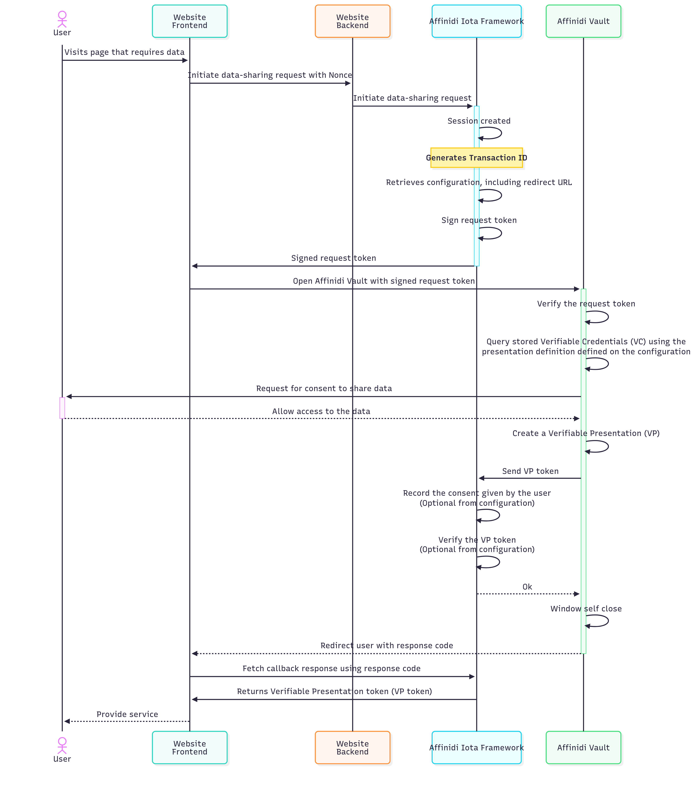

# 🚀 Affinidi Iota Configuration Guide

<div align="center">
  
</div>

> [!IMPORTANT]
> This guide is for learning, experimentation, and prototyping only.
> **Do not use this configuration as-is in production environments.**
> Please review, test, and secure your implementation before deploying to production.


## 📖 Table of Contents
- [Overview](#overview)
- [Architecture](#architecture)
- [Pre-Requisite](#pre-requisite)
- [Setup Instructions](#setup-instructions)
- [Environment Variable Setup](#environment-variable-setup)
- [Presentation Definitions](#presentation-definitions)
- [Code Reference](#code-reference)
- [Further Reading](#further-reading)
- [Disclaimer](#disclaimer)


## 🧭 Overview

**Affinidi Iota Framework** provides a secure and simplified data-sharing process from Affinidi Vault with user consent.
It leverages the [OID4VP](https://openid.net/specs/openid-4-verifiable-presentations-1_0.html) (OpenID for Verifiable Presentation) standard, built on OAuth 2.0, to request and receive credentials.


## 🏗️ Architecture

- **Iota Configuration:**
  Define wallets, redirect flow, and presentation definitions for credential queries.

- **Credential Query Flow:**
  


## 🧑‍💻 Pre-Requisite

> [!IMPORTANT]
> Mandatory steps before proceeding to next steps.

### Create Personal Access Token (PAT)

Personal Access Token (PAT) is like a machine user that acts on your behalf to the Affinidi services. You can use the PAT to authenticate to the Affinidi services and automate specific tasks within your application. A Personal Access Token (PAT) lives outside of Projects, meaning PAT can access multiple projects once granted by the user.

- More details: [Personal Access Token](https://docs.affinidi.com/dev-tools/affinidi-cli/manage-token/#how-does-pat-authentication-works)
- PAT is needed for `Affinidi TDK Auth provider`.

You can refer the [Affinidi Documentation](https://docs.affinidi.com/dev-tools/affinidi-cli/manage-token/#affinidi-token-create-token) for creating pesronal access token from CLI.

**Steps to Create PAT(Personal Access Token):**

1. **Log in to Affinidi CLI:**
   ```sh
   affinidi start
   ```

2. **Create a token:**
   ```sh
   affinidi token create-token
   ```

   Follow the instruction

   ```
    ? Enter the value for name workshopPAT
    ? Generate a new keypair for the token? yes
    ? Enter a passphrase to encrypt the private key. Leave it empty for no encryption ******
    ? Add token to active project and grant permissions? yes
    ? Enter the allowed resources, separated by spaces. Use * to allow access to all project resources *
    ? Enter the allowed actions, separated by spaces. Use * to allow all actions *
   ```

   **Sample response:**
   ```json
    Creating Personal Access Token... Created successfully!
    Adding token to active project... Added successfully!
    Granting permissions to token... Granted successfully!
    {
      "id": "**********",
      "ari": "ari:iam:::token/**********",
      "ownerAri": "ari:iam:::user/**********",
      "name": "workshopPAT",
      "scopes": [
        "openid",
        "offline_access"
      ],
      "authenticationMethod": {
        "type": "PRIVATE_KEY",
        "signingAlgorithm": "RS256",
        "publicKeyInfo": {
          "jwks": {
            "keys": [
              {
                "use": "sig",
                "kty": "RSA",
                "kid": "**********",
                "alg": "RS256",
                "n": "**********",
                "e": "AQAB"
              }
            ]
          }
        }
      }
    }

    Use the projectId, tokenId, privateKey, and passphrase (if provided) to use this token with Affinidi TDK
    {
      "tokenId": "*******",
      "projectId": "*******",
      "privateKey": "*******",
      "passphrase": "******"
    }
    ›   Warning:
    ›   Please save the privateKey and passphrase (if provided) somewhere safe. You will not be able to view them again.
    ›

   ```

   For more details on the command run the below command

   ```sh
   affinidi token create-token --help
   ```


- Create a Wallet in Affinidi Portal (only DID:Key is supported).
- Ensure your redirect URL matches your app endpoint (e.g., `http://localhost:8010/iota`).


## ⚙️ Setup Instructions

1. **Access Affinidi Portal:**
   Go to [Affinidi Portal](https://portal.affinidi.com/login) and navigate to the Iota Framework page.

2. **Create Configuration:**
   - Click **Create Configuration** and set:
     - **Wallet:** Create/select a wallet (DID:Key only).
     - **Data Sharing Flow Mode:** Redirect (reference implementation).
     - **Vault JWT Expiration Time:** Set credential offer lifetime.
     - **Redirect URLs:** `http://localhost:8010/Iota`
   - Optionally enable:
     - **Verification:** Verify credentials shared by users.
     - **Consent Audit Log:** Store user consent logs.

3. **Add Supported Schemas:**
   Define schemas for each credential type you wish to query.

4. **Create Presentation Definitions:**
   Use Presentation Exchange (PEX) to define queries for each VC type (see [Presentation Definitions](#presentation-definitions) below).


## ⚙️ Environment Variable Setup

Update your `.env` file with the required configuration:

```env
# Iota Config Redirect flow : Callback should be is `http://localhost:8010/Iota`
IOTA_CONFIG_ID="your-config-id"
IOTA_CREDENTIAL_QUERY_PERSONAL="your-personal-query-id"
IOTA_CREDENTIAL_QUERY_EMPLOYMENT="your-employment-query-id"
IOTA_CREDENTIAL_QUERY_EDUCATION="your-education-query-id"
IOTA_CREDENTIAL_QUERY_ADDRESS="your-address-query-id"
IOTA_CREDENTIAL_QUERY_SELECTIVE_SHARING="your-selective-sharing-query-id"
```

- Replace each value with the corresponding ID from your Iota configuration.
- Ensure the callback URL matches your app’s endpoint.


## 📚 Presentation Definitions

Define Presentation Exchange queries for each credential type.
Example for **Address Verification VC**:

```json
{
  "id": "address_verification_credentials",
  "input_descriptors": [
    {
      "id": "address_verification",
      "name": "VC",
      "purpose": "Check VC",
      "constraints": {
        "fields": [
          {
            "path": [
              "$.type"
            ],
            "purpose": "VC Type Check",
            "filter": {
              "type": "array",
              "contains": {
                "type": "string",
                "pattern": "AddressVerification"
              }
            }
          }
        ]
      }
    }
  ]
}

```

Example for **Personal Information Verification VC**

 ```json
{
  "id": "personal_information_credentials",
  "input_descriptors": [
    {
      "id": "personal_information",
      "name": "VC",
      "purpose": "Check VC",
      "constraints": {
        "fields": [
          {
            "path": [
              "$.type"
            ],
            "purpose": "VC Type Check",
            "filter": {
              "type": "array",
              "contains": {
                "type": "string",
                "pattern": "PersonalInformationVerification"
              }
            }
          }
        ]
      }
    }
  ]
}
 ```
Example for **Education Verification VC**

```json
{
  "id": "education_information_credentials",
  "input_descriptors": [
    {
      "id": "education_information",
      "name": "VC",
      "purpose": "Check VC",
      "constraints": {
        "fields": [
          {
            "path": [
              "$.type"
            ],
            "purpose": "VC Type Check",
            "filter": {
              "type": "array",
              "contains": {
                "type": "string",
                "pattern": "EducationVerification"
              }
            }
          }
        ]
      }
    }
  ]
}

```
Example for **Employment Verification VC**

```json
{
  "id": "employment_information_credentials",
  "input_descriptors": [
    {
      "id": "employment_information",
      "name": "VC",
      "purpose": "Check VC",
      "constraints": {
        "fields": [
          {
            "path": [
              "$.type"
            ],
            "purpose": "VC Type Check",
            "filter": {
              "type": "array",
              "contains": {
                "type": "string",
                "pattern": "EmploymentVerification"
              }
            }
          }
        ]
      }
    }
  ]
}

```

Example for **Selective Sharing VC**

> option 1 - Minimun and Maximum Credentials required
```json
{
  "id": "token_with_backgroundcheck_vc",
  "purpose": "{\"data_collection_purpose\": \"Analytics,Marketing,Personalisation\",\"request_description\": \"Please provide between 1 and 3 background check VCs.\"}",
  "input_descriptors": [
    {
      "id": "Background check",
      "name": "Background check VC",
      "purpose": "Check if Vault contains the required VC.",
      "group": [
        "background_check_group"
      ],
      "constraints": {
        "fields": [
          {
            "path": [
              "$.type"
            ],
            "purpose": "Check if VC type is correct",
            "filter": {
              "type": "array",
              "contains": {
                "type": "string",
                "pattern": "^.*Verification$"
              }
            }
          }
        ]
      }
    }
  ],
  "submission_requirements": [
    {
      "rule": "pick",
      "min": 1,
      "max": 3,
      "from": "background_check_group"
    }
  ]
}

```

> Option 2 - Define count of Credentials in a request

```json
{
  "id": "token_with_backgroundcheck_vc",
  "purpose": "{\"data_collection_purpose\": \"Analytics,Marketing,Personalisation\",\"request_description\": \"Please provide two background checks.\"}",
  "input_descriptors": [
    {
      "id": "Background check",
      "name": "Background check VC",
      "purpose": "Check if Vault contains the required VC.",
      "group": [
        "background_check_group"
      ],
      "constraints": {
        "fields": [
          {
            "path": [
              "$.type"
            ],
            "purpose": "Check if VC type is correct",
            "filter": {
              "type": "array",
              "contains": {
                "type": "string",
                "pattern": "^.*Verification$"
              }
            }
          }
        ]
      }
    }
  ],
  "submission_requirements": [
    {
      "rule": "pick",
      "count": 7,
      "from": "background_check_group"
    }
  ]
}
```

## 💻 Code Reference

### Iota Credential Query Flow in Django (Example: Query Personal Info Credential)

When the **"Query Personal Info Credential"** button is clicked in the Django app (see `iota.html`), the following process occurs:

1. **User Interaction (Frontend):**
   - The user clicks the button to query a credential (e.g., Personal Info, Employment, Education, Address, Selective Sharing).
   - This triggers a JavaScript handler or form submission to the backend endpoint (e.g., `/api/iota_start`).

2. **API Request (Frontend):**
   - The frontend sends a POST request with the selected query type and any required parameters.
   - The query IDs (e.g., `IOTA_CREDENTIAL_QUERY_PERSONAL`) are rendered into the template from Django view (`views.py`).

3. **Backend API Handler (Django):**
   - The Django API view (`api.py`) receives the request and reads the query type from the POST data.
   - It uses the corresponding environment variable (e.g., `IOTA_CREDENTIAL_QUERY_PERSONAL`) to build the query payload.
   - The backend calls the Iota service using a helper from `util.py` (see `iota_start_util`).

4. **Iota Service Interaction (Backend):**
   - The backend calls Affinidi Iota service with the payload and returns the result (see `iota_start_util` in `util.py`).

5. **Redirect Flow (Frontend/Backend):**
   - The user is redirected to the Iota service for authentication and credential sharing.
   - After completion, the user is redirected back to the callback URL (e.g., `/iota`).

6. **Result Display (Frontend):**
   - The frontend receives the response and updates the UI to show the shared credential or any error messages.

**Summary:**
- Button click triggers JS handler or form POST to `/api/iota_start`
- Django API view reads query type, builds payload, and calls Iota service
- Iota service returns result
- Frontend displays credential or error

#### Key Code References

- **Frontend:** `webapp/templates/webapp/iota.html` (button, JS handler)
- **Backend:**
  - `webapp/views.py` (Iota view logic, renders query IDs)
  - `webapp/api.py` (`iota_start` and `iota_complete` endpoints)
  - `webapp/util.py` (`iota_start_util`, `iota_completed_util` for API integration)

#### Example Flow (Django)

**1. Frontend Button (iota.html):**
```html
<button id="iota-btn" onclick="queryIota('personal')">Query Personal Info Credential</button>
```

**2. JavaScript Handler (iota.html):**
```js
function queryIota(type) {
  fetch('/api/iota_start', {
    method: 'POST',
    headers: { 'Content-Type': 'application/json' },
    body: JSON.stringify({ queryType: type })
  })
  .then(response => response.json())
  .then(data => {
    // Handle redirect or display result
  });
}
```

**3. Django API Endpoint (api.py):**
```python
@csrf_exempt
def iota_start(request):
  if request.method == "POST":
    try:
      data = json.loads(request.body)
      query_type = data.get("queryType")
      # Use environment variable for query ID
      # Build payload and call util.iota_start_util
      result = iota_start_util(payload)
      return JsonResponse(result, safe=False)
    except Exception as e:
      return JsonResponse({"error": str(e)}, status=500)
  return JsonResponse({"error": "Invalid request method."}, status=400)
```

**4. Utility Function (util.py):**
```python
def iota_start_util(iota_start_input):
  # Build and send request to Affinidi Iota API
  # Return result or error
```

**5. Django View (views.py):**
```python
def iota(request):
  config_id = os.environ.get("IOTA_CONFIG_ID", "")
  query_id_personalInformation = os.environ.get("IOTA_CREDENTIAL_QUERY_PERSONAL", "")
  # ...other query IDs...
  return render(
    request,
    "webapp/iota.html",
    {
      "config_id": config_id,
      "query_id_personalInformation": query_id_personalInformation,
      # ...other query IDs...
    },
  )
```

**6. Token Generation (util.py):**
```python
def pst():
  # Fetch and cache project scoped token for API calls
```

Refer to the above files for implementation details. All environment variables for query IDs and config IDs are set in `.env` and loaded in Django views and utility functions.

## 📚 Further Reading

- [Affinidi Iota Documentation](https://docs.affinidi.com/docs/affinidi-elements/iota/)
- [Affinidi Portal](https://portal.affinidi.com/)
- [Presentation Exchange (PEX)](https://identity.foundation/presentation-exchange/)

## _Disclaimer_

_This documentation is provided for informational purposes only and is not a legal document. For legal terms, conditions, and limitations, please refer to the official Affinidi documentation and your service agreement._